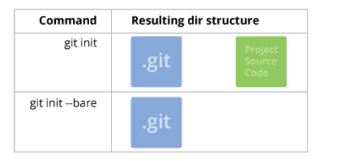
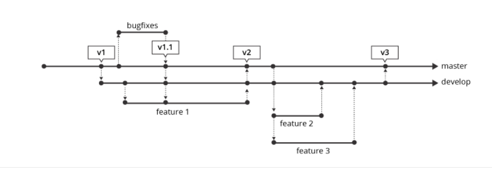
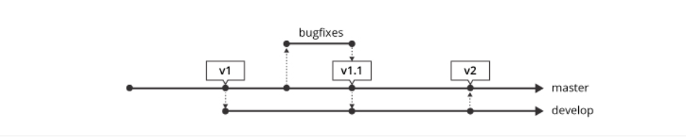
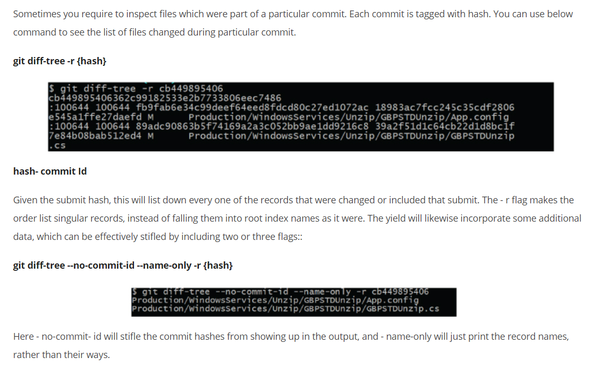

### 1.What are the steps of git local workflow?

1. For starting local, we initialize our current working project directory using 'git init' or 'git init <your-project-name>'(this will create a new directory with provided your-project-name as working directory) command and on the GitHub site set up your GitHub repository.
2. Now in the local working directory, we do changes (either adding/editing files etc)
3. Then we're going to 'stage' our changes using the "git add" command
4. Then commit our changes that are in the staging area using the 'git commit -m <your custom message here>'
5. Setup a remote repository (origin) using command 'git remote add origin git@github.com:User/UserRepo.git' (you can change it later using command 'git remote set-url origin git@github.com:User/UserRepo.git')
6. Once we're ready to collaborate with others on the main repository, we'll push our changes up to our remote repository on GitHub(or the hosted remote repository) using command 'git push -u origin master'; here -u is upstream(use it only for first push command just once), origin is remote name and master is the branch's name.
7. Once everyone else had pushed their changes to the remote repository,then we'll do a pull from the remote repository to our local git repository using 'git pull' or 'git pull <remote-name> <branch-name>' command
8. Later on whenever doing new working the local repo; do 'git pull' and then start new work.
 
### 2.What are the steps of git remote workflow?

1. On the GitHub set up your remote GitHub repository
2. Then do a git's clone using 'git clone' command to create a new repository on our local system.
3. Now in the local working directory we do changes(either adding/editing files etc)
4. Then we're going to 'stage' our changes using the "git add" command
5. Then commit your changes that are in the staging area using the 'git commit -m <your custom message here>'
6. Setup a remote repository(origin) using command 'git remote add origin git@github.com:User/UserRepo.git' (you can change it later using command 'git remote set-url origin git@github.com:User/UserRepo.git')
7. Once we are ready to collaborate with others on the main repository, we'll push our changes up to our remote repository on GitHub(or the hosted remote repository) using command 'git push -u origin master'; here -u is upstream(use it only for first push command just once), origin is remote name and master is the branch's name.
8. One everyone else had pushed their changes to the remote repository,then we'll do a pull from remote repository to our local git repository using 'git pull' or 'git pull <remote-name> <branch-name>' command
9. Later on whenever doing new working the local repo; do 'git pull' and then start new work.

### 3.How to do git configuration to get or set various user options?

When reading/getting, the values are read from the system, global and repository local configuration files by default, and options --system, --global, --local and --file <filename> can be used to tell the command to read from only that specific location. When writing, the new value is written to the repository local configuration file by default(--local), and options --system, --global, --file <filename> can be used to tell the command to write to that location.

1. Set a user's email-id (to be recorded in any newly created commits) : git commit --global user.email "sc.2017.india@gmail.com" 
2. Set a user's full name (to be recorded in any newly created commits) : git commit --global user.name "Sandeep Choudhary"
3. Set signed key for a signed tag or commit : git config --global user.signingkey <your-signed-key-here> Command 'git config --global --list' will show all of the current global settings/options.
4. Configuration saved using '--global' is stored in a file '.gitconfig' in the current user's home directory. User's name and email-id should be set before using git further.

### 4. How to view the commit history of the repository?
Using command ‘git log"; this command displays commits list(in chronological order) from latest to old one in descending order of the committed date. For each commit record it displays- 

* Commit id (SHA-1 has code)
* Author's (user's) name and email-id Date and time
* Commit message provided at time of commit
* To make the output more compact or custom; we can use lot of other options along  with command e.g. 'git log -- oneline'

### 5. What are the steps to permanently remove a committed file from the repository?
To remove a file for example 'myfile.txt'; which is already committed and a part of repository, the first step is to 'staging' this file deletion using 'git rm myfile.txt' command. After this command if we use 'git status' it will show message e.g. 'deleted: myfile.txt' . Now as second step to make it permanently we have to commit this staging using 'git commit -m <your message>' command.

Another way is if we remove the file 'myfile.txt' from the working directory manually for example using terminal rm command or using menu as we delete file normally using operating system's GUI. post manual removal the 'git status' command will display the message 'Changes not staged for commit:' and file information like 'deleted: myfile.txt'. To stage these manual changes(we can say same behaviour as working directory changes of add/remove/update files) we have to use -u (recursively update) option with add e.g. 'git add -u'(pre git 2.0 version) or 'git add .'(git 2.0 and above version) command. Then use git commit command to make them permanent

### 6.How do you restructure the working directory files in git repository?

For example if we have a file called 'myfile.txt' to restructure/move in the sub directory 'mydir' under git's working directory; rather than cut and paste(manual mv command), we can use 'git mv <file-name> <target-dir-name>' e.g. 'git mv myfile.txt mydir'. This will move the file to provided directory and marks it to 'staging'. If we use 'git status' command now, it will display changes available to commit e.g. 'renamed: myfile.txt -> mydir/myfile.txt'. Now using git commit command make this restructuring permanently in the repository.

If we move file/folder out of the working directory (basically like permanently removing a committed file from the repository) then post movement we have to use 'git add -u' command to mark it staging and then commit command to make it permanently.

### 7.How to configure git to not to add and commit non-source files like IDE configuration or debug log files?
In the working directory, create a new file '.gitignore'; basically this file's each line will contain a entry(file or folder name or file extension with filter) to be ignored by git to add or commit in the repository. for example if we want ignore all of the file with '.debug' extension then add a entry '*.debug' in the file. Stage this file '.gitignore' using 'git add .' and then commit it to repository.

### 8. How do you setup and use SSH authentication to connect with github/remote repository?
* To do SSH setup for git; we need to create a '.ssh' directory in the user's home directory.
* Then in inside (using 'cd' command) this (e.g. '/Users/SandeepChoudhary/.ssh') newly directory, use command 'ssh-keygen -t rsa -C "<your-email-id>"'. Here -t is used to specify type of key to create and -C(in upper case only) to provide the comment in this case the email-id.
* Then during execution of this command, provide inputs like name of file to save the key(just press enter so by default it will be saved in 'id_rsa' file, provide passphrase. Now a file 'id_rsa.pub' will be created in '.ssh. Directory.
* Now on the github under 'Account Settings' > 'SSH keys' > 'Add SSH key', provide custom title as this ssh key will be tightly coupled with your specific machine where ssh key is generated. Under key option, copy paste the content of the 'id_rsa.pub' file from your machine to here and click 'add key'.
* Now on your machine using command 'ssh -T git@github.com' you will establish a ssh connection/tunnel with github.

### 9. How do you manage set of tracked/remote repositories?
We add a remote repository(origin) using command 'git remote add origin git@github.com:User/UserRepo.git' (you can change it later using command 'git remote set-url origin git@github.com:User/UserRepo.git').

We can list the remote repositories using 'git remote -v' command and this will display the name and the url of the remote repositories.

We push our changes up to our remote repository using command 'git push -u origin master'; here -u is upstream(use -u only for first push command just once), origin is remote name and master is the branch's name.

Then we'll do a pull from remote repository to our local git repository using 'git pull' or 'git pull <remote-name> <branch-name>' command to receive all your remote changes (commits) from the remote repository

### 10.How to know what are the different saved states/stash of the current working directory?
Using the command 'git stash list'. The output of this command is a list of the saves states starting from zero the latest to the oldest one. Each entry has the stash index starting from zero e.g. stash@{n} where n is index, followed by the branch name and the summarized description.

11.What is git stash drop?
If at any point of time we want to remove a single stashed state from the stash list, we use the command 'git stash drop'(it will remove the latest from list i.e. stash@{0}) or 'git stash drop stash@{n}'; here stash@{n} must be a valid stash log reference as displayed in stash list command's output.

### 12. Explain the steps to work on any production issue in GIT

Let's go through the steps to understand flow in case we are working on any production issue :
```sh
Step 1: We will create a local branch for developing any feature /bug which will be a child branch inherited from the production branch. The below command will create headerissue branch locally on which developer would work and fix production issues.
git checkout -b headerissue production branch We can check the branches existing locally by running below command.

step 2:  git branch -List all branches existing locally You can progress the changes by running below command
step 3:  git status- To see any changes in the branch
step 4: Once you are done with changes committing changes locally not remotely.  Once unit testing and Release testing gets completed, you can move to merge the changes in the production branch.
step 5:  Now you can move to the production branch
$ git checkout productionbranch
Switched to branch productionbranch and merge the changes once

   $ git merge --no-ff headerissue (merging with issue branch)
   $ git branch -d headerissue(delete local branch)
   $ git push origin productionbranch (pushing issue fix in production branch)
```
### 13. What do understand by ‘bare repository’ in Git?
A git bare repository is helpful when you would like to collaborate with other users but don’t want to use a hosting service like GitHub. In such cases, you can set up a remote server that is only accessible by your internal team, create a bare repository over there, which acts as the central git server from which each of you can push and pull your code from your local boxes.

A bare repository made with git init -- bare is for sharing. On the off chance that you are working together with a group of designers, and need a spot to share changes to a repo, at that point you will need to make a bare repo in a centralized spot where all clients can push their changes (frequently the simple decision is GitHub). Since GIT is an appropriated rendition control framework, nobody will legitimately alter documents in the common brought together storehouse. Rather designers will clone the mutual bare repo, make changes locally in their working duplicates of the repo, at that point push back to the commonly exposed repo to roll out their improvements accessible to different clients.

Since nobody ever makes alters straightforwardly to records in the mutual bare repo, a working tree isn't required. Actually, the working tree would simply get in the way and cause clashes as clients to push code to the store. This is the reason uncovered storehouses exist and have no working tree.

How do I make existing non-bare repository bare?

After making sure that there are no uncommitted changes, etc.:
```sh
$ mv repo/.git repo.git
   $ git --git-dir=repo.git config core.bare true
   $ rm -rf repo
```
### 14. What is a Sub Git?
SubGit is a device for empowering a consistent and calm SVN to Git relocation. It makes a writable Git reflection of a neighbourhood or remote Subversion archive and utilizes both Subversion and Git as long as you can imagine. It creates a bi-directional mirror that can be used for pushing to Git as well as committing to Subversion. SubGit also takes care of synchronization between Git and Subversion. It requires access to your GitLab server as it interacts with the Git repositories directly in a filesystem level.

Some of the benefits of using SubGit tool are as follows:
```sh
Single, concentrated mirror area and set-up
No uncommon directions - utilize the full intensity of Git on the customer side
Move clients and instruments to Git at agreeable pace with zero vacation and no medium-term switches
Handle standard, custom or single-catalogue SVN ventures
```

### 15. What is git hooks?
Sometimes there is a need to enforce policies, ensure consistency, and control your environment, and even handle deployment tasks. Git hooks are a basic idea that was actualized to address a need. When creating programming on a common undertaking, keeping up style direct norms, or while conveying programming (all are circumstances that git is regularly included with), there are frequently dull errands that you will need to do each time an activity is taken. Git snares are occasion based. When you run certain git directions, the product will check the hooks catalogue inside the git store to check whether there is related content to run. Git hooks are run locally.

Some example hook scripts include:
```sh
`pre-commit:` Check the commit message for spelling errors.
`pre-receive:` Enforce project coding standards.
`post-commit:` Email/SMS team members of a new commit.
`post-receive:` Push the code to production.
Every Git repository has a .git/hooks folder with a script for each hook you can bind to. You're free to change or update these scripts as necessary, and Git will execute them when those events occur.

Git hooks are divided into two categories:

`Client-Side Hooks:` Hooks that are called and executed on the committer's computer.
Server-Side Hooks: These hooks are executed on servers that are used to receive pushes.
```
### 16. Why do we use git bisect?

GIT cut up completes a paired inquiry to locate a specific relapse which is a guilty party of submitting some wrong code in archive. It is preposterous to expect to assess every single resolve to discover the relapse as it is very time-consuming. Suppose you have beneath improvement history :

... - 0 - 1 - 2 - 3 - 4* - 5 - current

You come to realize that your program isn't working accurately at the present correction, and it was working at the modification 0. So the relapse was likely presented in one of the submits 1, 2, 3, 4, 5, current.

You can attempt to check each submits, manufacture it, check if the relapse is available or not. On the off chance that there is countless, this may take quite a while. This is a straight pursuit. We can improve by completing a double pursuit. This is the thing that the git divide order does. At each progression, it attempts to decrease the number of amendments that are conceivably awful significantly.

You'll utilize the order this way:
```sh
$ git stash save
$ git bisect start
$ git bisect bad
$ git bisect good 0

Bisecting: 2 revisions left to test after this (roughly 2 steps)
[< ... sha ... >] 3
```
After this direction, git will check out a submit. For our situation, it'll be submitting  3. You have to fabricate your program and check whether the relapse is available. You'll likewise need to tell git the status of this modification with either git bisect awful if the relapse is available, or git bisects great on the off chance that it isn't.

How about we guess that the relapse was presented in submit 4. At that point, the relapse is absent in this update, and we tell it to git.
```sh
$ make
$ make test
... ... ...
$ git bisect good
Bisecting: 0 revisions left to test after this (roughly 1 step)
[< ... sha ... >] 5
```
It will then check out another submit. Either 4 or 5 (as there are just two submits). We should assume it picked 5. After manufacture, we test the program and see that the relapse is available. We at that point tell it to git:
```sh
$ make
$ make test
... ... ...
$ git bisect bad
Bisecting: 0 revisions left to test after this (roughly 0 steps)
[< ... sha ... >] 4
```
We test the last modification, 4. Furthermore, since the one presented the relapse, we tell it to git::
```sh
$ make
$ make test
... ... ...
$ git bisect bad
< ... sha ... > is the first bad commit
< ... commit message ... >
```
In this basic circumstance, we just needed to test 3 forms (3, 4, 5) rather than 4 (1, 2, 3, 4). This is a little win, however, this is on the grounds that our history is so little. On the off chance that the pursuit run is of N submits, we ought to hope to test 1 + log2 N submits with git bisect rather than generally N/2 submits with a direct hunt.

When you've discovered the submit that presented the relapse, you can ponder it to discover the issue. When this is done, you use git bisect reset to return everything on the first state before utilizing git bisect direction.

### 17. what are branching strategy in GIT?
it is important to understand the basics of Git version control. There are a parcel of individuals that utilizes IDE's and visual instruments to do the essential tasks like commit and push changes, make and union branches, think about history and return changes, without figuring out how Git really works. The expanding technique relies upon the span of your group, the number of groups taking a shot at the venture, if the undertaking has more than one element being created in the meantime, the recurrence you discharge code to generation… the more unpredictable your situation, the more you depend on an appropriate branch methodology to help it

There are three popular branching models in GIT.

* A component branch model keeps the majority of the progression for a specific element within a branch. At the point when the element is completely tried and approved via computerized tests, the branch is then converged into an ace.


* In this model, each undertaking is actualized without anyone else branch with the assignment key incorporated into the branch name. It is anything but difficult to see which code actualizes which task, simply search for the undertaking key in the branch name.


* Once the create branch has gained enough highlights for a discharge, you can clone that branch to shape a Release branch. Making this branch begins the following discharge cycle, so no new highlights can be included after this point, just bug fixes, documentation, and other discharge situated assignments ought to go in this branch. When it is prepared to dispatch, the discharge gets converged into an ace and labelled with a variant number. Moreover, it ought to be converted once again into creating a branch, which may have advanced since the discharge was started.

### 18. One of your teammates accidentally deleted a branch and has already pushed the changes to the central git repo. There are no other git repos, and none of your other teammates had a local copy. How would you recover this branch?
Check out the latest commit to this branch in the reflog, and then check it out as a new branch. Reflog is a mechanism to record when the tip of branches are updated. This command is to manage the information recorded in it. Basically every action you perform inside of Git where data is stored, you can find it inside of the reflog.

git reflog won't navigate HEAD's progressive system by any stretch of the imagination. The reflog speak to the requested rundown of the submits that HEAD has indicated: it's fixed history for our repo. The reflog isn't a piece of the repo itself (it's put away independently to the submits themselves) and is excluded in pushes, gets or clones; it's absolutely neighbourhood. you can't generally lose information from your repo once it's been dedicated. On the off chance that you incidentally reset to a more established submit, or rebase wrongly, or whatever other tasks that outwardly "evacuate" submit, you can utilize the reflog to see where you were previously and git reset - hard back to that ref to reestablish your past state

### 19.How do you find the list of files changed in particular commit?


### 20.In how many ways we can refer commits in GIT?
In Git, each commit is extraordinarily recognized by a novel hash number. These hashes can be utilized to distinguish the related commit much of the time, (for example, when we attempt to check out a specific condition of the code utilizing the git checkout {hash} order).

Aside from this, Git dependably keep data on various nom de plumes to guide to a specific commit, known as refs. Likewise, every single label that we make in the repo turns into a ref (and that is actually why we can utilize labels rather than submit hashes in different git directions). Git dependably keeps up various extraordinary false names that change depending on the condition of the archive, for example, HEAD, FETCH_HEAD, MERGE_HEAD, and so forth.

Git dependably permits resolves to be alluded as in respect to each other. For instance, HEAD~1 alludes to the commit parent to HEAD, HEAD~2 alludes to the grandparent of HEAD, etc. In the event of consolidation commits, where the commit has two guardians, ^ can be utilized to choose one of the two guardians, for example, HEAD^2 can be utilized to pursue the second parent.

Lastly, refspecs. These are constantly used to outline and remote branches together. In any case, these can be utilized to allude to commits that live on remote branches enabling one to control and control them from a neighborhood Git condition.

 