## 1.Why do we use Jenkins?
Jenkins is an open source tool written in Java with modules worked for Continuous Integration reason. Jenkins is utilized to construct and test your product extends consistently making it simpler for engineers to coordinate changes to the undertaking, and making it simpler for clients to acquire a new form. It additionally enables you to persistently convey your product by coordinating with an enormous number of testing and arrangement innovations. With Jenkins, associations can quicken the product improvement process through computerization. Jenkins incorporates improvement life-cycle procedures of assorted types, including manufacture, record, test, bundle, organize, convey, static examination and considerably more. Jenkins facilitate Continuous Integration with the help of various plug-ins. Plug-in allows the combination of Various DevOps stages. If we need a specific use case, we have to introduce the plug-in for those tools. For example Git, Maven 2, Amazon EC2, HTML distributer and so on.
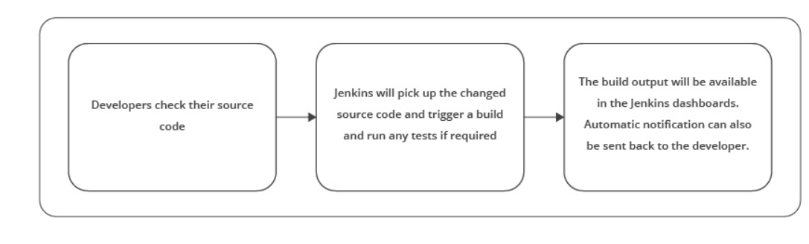

## 2. What is meant by continuous integration in Jenkins?
Consistent integration is a procedure where all development work is incorporated as ahead of schedule as could reasonably be expected. The subsequent artifacts are consequently made and tried. This procedure permits to recognize mistakes as ahead of schedule as could reasonably be expected. Jenkins is a well known open source device to perform constant integration and build. Prior to CI, Nightly build was famous where code was getting pulled distinctly around evening time however CI guaranteed the early discovery of deformitie
```sh
Continuous Integration has numerous advantages: 

* Bid a fond farewell to long and tense combinations
* Increment perceivability empowering more noteworthy correspondence
* Catch issues early and halt them from developing in any way
* Invest less energy investigating and additional time including highlights
* Fabricate a strong establishment
* Quit holding on to see whether your code's getting down to business
* Diminish incorporation issues enabling you to convey programming all the more quickly
```
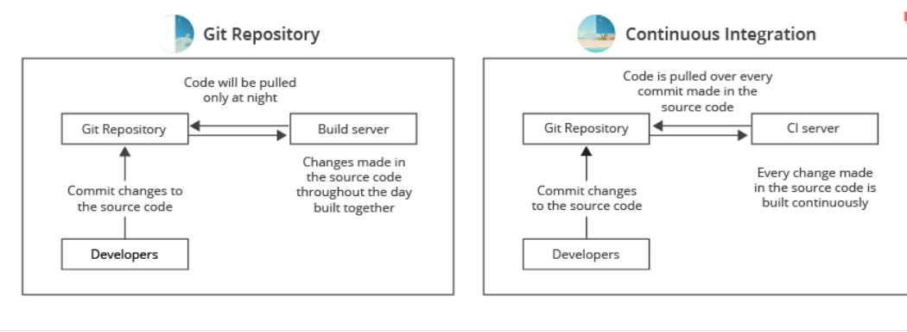

## 3. Name some popular  CI Tools.

Here is a rundown of the main 8 Continuous Integration tools:

`Jenkins`: Jenkins is an open-source CI tool written in Java.

`TeamCity:` TeamCity is the full-grown CI server, originating from the labs of the JetBrains organization. Incredible arrangement by and large, however because of its intricacy and value, more qualified for big business needs.

`Travis CI:` A Mature arrangement that offers both facilitated and On-premises variations, cherished and utilized by numerous groups, very much reported.

`Go CD:` Go is the most up to date Cruise Control manifestation from the ThoughtWorks organization. Barring the business bolster that ThoughtWorks offers, Go is for nothing out of pocket. It is accessible for Windows, Mac, and different Linux circulations.

`Bamboo:` It is Atlassian offerings.Great On-premises CI instrument that initially offered Cloud arrangement as well. Bitbucket Pipelines supplanted the cloud arrangement. A Pipeline is a cutting edge and quick cloud CI instrument incorporated into Bitbucket. Has a free preliminary for 30 days, and paid plans after that.

`GitLab CI:` GitLab CI is a fundamental piece of the open-source Rails venture GitLab, which was exposed by the organization GitLab inc

`CircleCI:` Another cloud elective that originates from the organization with a similar name. CircleCI as of now just backings GitHub and the rundown of upheld dialects incorporates Java, Ruby/Rails, Python, Node.js, PHP, Haskell, and Scala.

`Codeship:` Codeship comes in two unique variants: Basic and Pro. The fundamental form offers out-of-the-container Continuous Integration administration yet doesn't have docker backing and its principal intention is to construct applications with normal work processes through the UI. Star form offers greater adaptability and docker support.

## 4. Which SCM tools Jenkins supports?
SCM stands for Source Code Management is an integral part of any development project in the current IT world. It is very critical to manage source code in an efficient way. There are several SCM tools which are available. Some advantages of using SCM:

`Backups:` Always accept that your PC is going to be sucked into a monstrosity dark opening at any second and work to limit the misfortune from that. Source control enables you to effortlessly push finished work to a remote host so little work is lost with a solitary PC.

`Record of work:` On numerous ventures, there's intermittently when you need to return the code to a past state to perceive how something was done, if a bug was available, or work out why the present code is broken. Source control makes this simple.

`Arrangement:` Having source control enables you to robotize fabricates and organizations. No one ought to ftp records around any longer as that is inclined to human blunder.

`Forming:` It's anything but difficult to swap between renditions of your code, giving you a chance to switch between fixing a little bug underway and thoroughly reworking your key usefulness.

`Simple venture setup:` As a task's source code can likewise incorporate arrangement contents, introduce records, and so forth… at that point setting up an undertaking can be as simple as cloning the storehouse and running a few contents to set up a domain that is indistinguishable from every single other designer.

Jenkins underpins AccuRev, CVS, Subversion, Git, Mercurial, Perforce, ClearCase and RTC. For every one of them exists a module and as you likely definitely know, Jenkins isn't constrained to just that rundown, anybody can make an SCM module for different choices on the off chance that they need to.

Here is the connection to the modules: 
```sh
ClearCase: https://wiki.jenkins-ci.org/display/JENKINS/ClearCase+Plugin
RTC: https://wiki.jenkins-ci.org/display/JENKINS/Team+Concert+Plugin
Git: https://wiki.jenkins-ci.org/display/JENKINS/Git+Plugin
Mercurial: https://wiki.jenkins-ci.org/display/JENKINS/Mercurial+Plugin
Perforce: https://wiki.jenkins-ci.org/display/JENKINS/Perforce+Plugin
AccuRev: https://wiki.jenkins-ci.org/display/JENKINS/AccuRev+Plugin
CVS: https://wiki.jenkins-ci.org/display/JENKINS/CVS+Plugin
Subversion: https://wiki.jenkins-ci.org/display/JENKINS/Subversion+Plugin
```
## 5. How do you schedule a build in Jenkins?

In Jenkins, under the job configuration arrangement, we can characterize different build triggers. Basic discover the 'Build Triggers' segment and check the ' Build Periodically' checkbox. With the occasionally build you can plan the construct definition by the date or day of the week and an opportunity to execute the assembly. The configuration of the 'Schedule' textbox is as per the following:

MINUTE (0-59), HOUR (0-23), DAY (1-31), MONTH (1-12), DAY OF THE WEEK (0-7)

In the activity design page, we should look down directly to the Build Triggers area. Since we expect to make a direct activity, we should choose the checkbox stamped Build intermittently. When we select this checkbox, a Text Box is shown with the Schedule name. We need to offer some benefit in a Cron-consistent arrangement. There's broad data accessible on the page in the event that we click the question mark next to the textbox.

Let’s type */2 * * * * here, which represents an interval of two minutes


After selecting out of the content box, we can see data directly underneath the container. It enlightens us regarding when will the activity keep running straightaway. How about we spare the activity – in around two minutes, we should see the status of the principal execution of the activity:

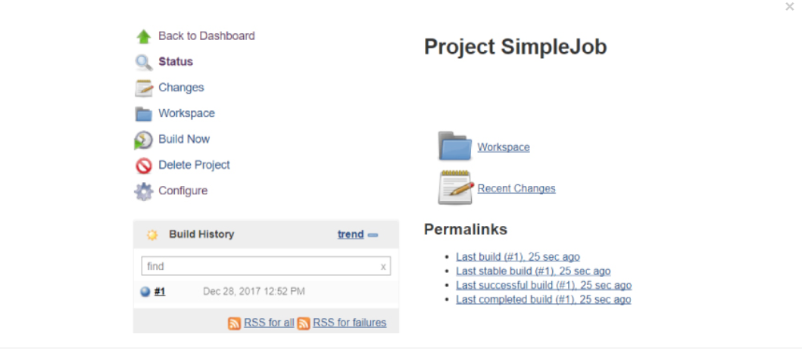

## 6. What Are The Advantages Of Jenkins?

In the present DevOps world, continuous delivery and deployment are basic to conveying fantastic programming item quicker than any time in recent memory. Jenkins is an open-source persistent incorporation server written in Java. It is by a wide margin the most generally utilized instrument for overseeing constant reconciliation builds and delivery pipelines. It helps engineers in structure and testing programming continuously. It expands the size of mechanization and is rapidly picking up ubiquity in DevOps circles. One of the key points of interest of Jenkins is that it requires little upkeep and has worked in a GUI apparatus for simple updates. Jenkins additionally gives tweaked arrangement as there are more than 400 modules to help to build and to test essentially any venture. By executing the correct setup for you, you get practically prompt input. You will dependably know whether the manufacturer broke. You will become more acquainted with what the explanation behind occupation come up short was and you can likewise become acquainted with how you can return it.

Advantages of Jenkins include: 

1. Bugs tracking are simple at a beginning period being developed condition.
2. Gives an enormous number of module support.
3. Iterative improvement to the code.
4. Build failures are stored at incorporation arrange.
5. For each code commit changes a programmed assemble report warning produces.
6. To advise engineers about build success /failures, it is coordinated with the LDAP mail server.
7. Accomplishes continuous integration agile development and test driven improvement.
8. With straightforward advances, the maven release project is automated.

## 7. What does it mean to shift left in DevOps?

If you somehow managed to diagram the conventional programming development life cycle on a bit of paper, the left half of the chart would almost certainly incorporate tasks, for example, design and development, while the right side would probably incorporate client feedback, stress testing, and production staging. To move left in DevOps infers a longing to take a significant number of those undertakings that regularly occur close to the finish of the application advancement procedure and move them into prior stages. Now and again, this may intend to join static code investigation schedules in each build. Another approach to play out a DevOps move left is to make production-ready artifacts toward the finish of each Agile sprint with the goal that clients and partners can get gradual reports on how improvement is advancing. Proper DevOps means moving left however much as could be expected.
Shifting left testing in software production allows developers to catch and fix issues earlier.

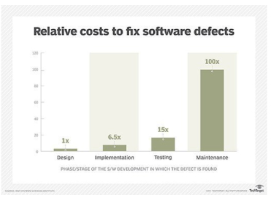

## 8. What are the software prerequisites that must be met before Jenkins is installed?

`Prerequisites:` Before you continue to introduce Jenkins in your windows framework, there are a few requirements for Jenkins to introduce Jenkins in your PC.

`Hardware requirements: `
You need at least 256 MB of RAM in your PC or workstation to introduce Jenkins. You need in any event 1 GB of space in your hard drive for Jenkins.

`Software Requirements:`
Since Jenkins keeps running on Java, you need either Java Development Kit (JDK) or Java Runtime Environment (JRE).

`Release Types:` Jenkins releases two sorts of adaptations dependent on enterprise needs. Long-term support release, Weekly release

`Long-term support release (LTS):` Long-term support releases are accessible at regular intervals. They are steady and are generally tried. This release is expected for end clients.

`Weekly release:` Weekly release are made accessible consistently by fixing bugs in its prior rendition. These releases are expected towards module engineers. We will utilize the LTS release however the procedure continues as before for Weekly release.

## 9. How can you move or copy Jenkins from one server to another?

Move a job starting with one installation of Jenkins then onto the next by just duplicating the relating work directory. Make a duplicate of a current job by making a clone of a job directory by an alternate name. Rename a current job by renaming a directory. Note that on the off chance that you change a job name you should change whatever other activity that endeavors to call the renamed job. Those tasks should be possible notwithstanding when Jenkins is running. For changes like these to produce results, you need to click "reload config" to compel Jenkins to reload design from the disk.

Follow these steps to move or copy Jenkins from one server to another:

1. Copy the related job directory and move a job from one installation of Jenkins to another.
2. Make a copy of an already existing job by making a clone of a job directory by a different name.
3. Renaming an existing job by renaming a directory.
4. We can also try one of the plug-ins as well as having Job export options like Job Importer Plug-in. Jenkins CLI can be also used if 5 we have less number of jobs but usually at the enterprise level, we have a large number of jobs so not widely used.

## 10. What is the use of Ansible in Jenkins?

Ansible is an incredible asset for IT automation and can be utilized in a CI/CD procedure to arrangement the target environment and to an application on it. The most effective method to utilize Ansible for environment provisioning and application deployment in a Continuous Integration/Continuous Delivery (CI/CD) process utilizing a Jenkins Pipeline. Jenkins is a notable tool for automation CI/CD. Shell scripts are regularly utilized for provisioning environments or to deploy applications amid the pipeline stream. Despite the fact that this could work, it is bulky to keep up and reuse contents over the long haul.

The motivation behind utilizing Ansible in the pipeline stream is to reuse jobs and Playbooks for provisioning, leaving Jenkins just as a procedure orchestrator rather than a shell script agen

The above  represents the accompanying engineering components:

* Github is the place where our project is facilitated and where Jenkins will survey for changes to begin the pipeline stream.
* SonarSource is our source code analysis server. On the off chance that anything turns out badly amid the examination (for example insufficient unit tests), the stream has interfered. This progression is imperative to ensure the source code quality record.
* Nexus is the artifact archive. After an effective accumulation, unit tests, and quality examinations, the binaries are transferred into it. Later those binaries will be downloaded by Ansible amid the application deployment.
* The Ansible Playbook, which is a YAML record coordinated in the application source code, conveys the Spring Boot App onto a CentOS machine.
* Jenkins is our CI/CD process orchestrator. It is dependable to assemble every one of the pieces, bringing about the application effectively deployed in the target machine.
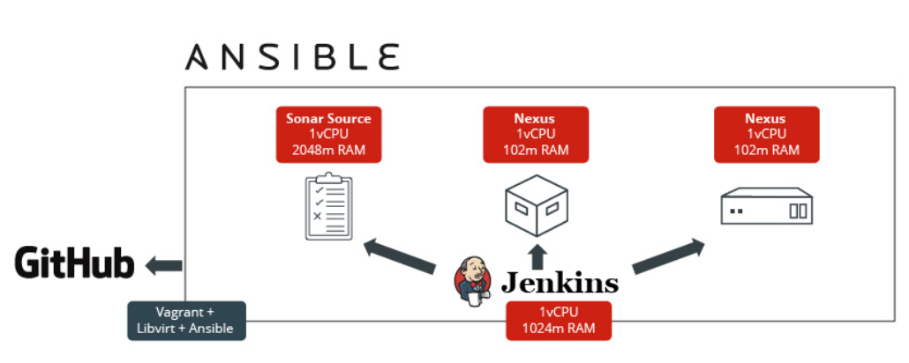

## 11. Name four important KPI in DevOps.

Individuals utilizing DevOps practices depend on a few key performance indicators(KPIs) to pass judgment on the achievement of their DevOps endeavors:

`Deployment frequency:` The capacity to make code changes rapidly and effectively is a key upper hand for any organization that necessities to convey new highlights rapidly to clients, and react to their feedback.
`Speed of deployment:` Frequent code deployment depends in enormous part on having the option to move rapidly from committed code to that code running effectively in the production condition.
`Failure Rate:` It is extraordinary to send all the more regularly and rapidly, however on the off chance that changes bomb similarly as every now and again, you've picked up nothing. Failed deployments can bring services down, bringing about lost income and baffled clients. DevOps practices can have a major effect on the failure rate.
`Time to Recovery:` At the point when service goes out, the capacity to recuperate rapidly can have an immense effect on business results. It's not astonishing, at that point, that enormous web organizations like Google, Etsy, Netflix, and Amazon push the envelope in their endeavors to improve time to recuperation, normally breaking their applications and foundation to find -   arrangement against - anything that can turn out badly.

## 12. What is Groovy in Jenkins?
Groovy is the default scripting language that is being utilized being developed from JMeter Version 3.1. Presently Apache Groovy is the dynamic object-oriented programming language that is utilized as a scripting language for the Java stage. Apache Groovy accompanies some valuable highlights, for example, Java Compatibility and Development Support. The groovy module adds the capacity to straightforwardly execute Groovy code.

To arrange accessible Groovy installation on your framework, go to Jenkins setup page, discover area 'Groovy' and fill the structure as appeared.

On the off chance that you don't arrange any Groovy establishment and select (Default) choice in a job, the module will fall back into considering only the groove order, accepting you have awesome paired on the default way on a given machine.

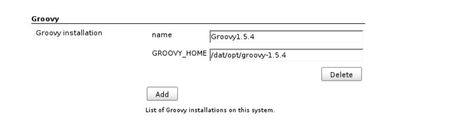

## 13. What is Jenkins file?

For defining a Pipeline in SCM, a Jenkins file is a text file that contains the meaning of a Jenkins Pipeline and is registered with source control. Consider the accompanying Pipeline which executes an essential three-organize continuous delivery pipeline. Making a Jenkins file, which is registered with source control, gives various prompt advantages:

```sh
1. Code review/emphasis on the Pipeline
2. Audit trail for the Pipeline
3. Single wellspring of truth for the Pipeline, which can be seen and altered by numerous individuals from the undertaking.
Please find below Pipeline which implements a basic three-stage continuous delivery pipeline:
```
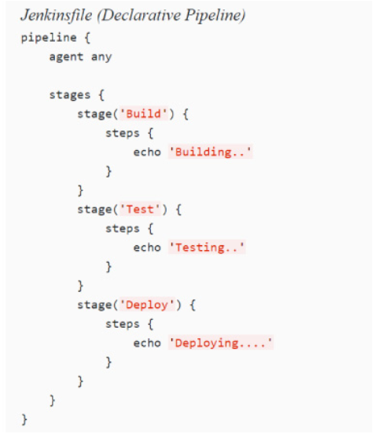

## 14. What do you do to make sure that your project build doesn't break in Jenkins?

We ensure that we perform effective clean introduce on our local machine with all unit tests. At that point, we ensure that we check in all code changes. We do complete a Synchronize with the archive to ensure that all required config and POM changes and any differences are registered with the repository. You have to pursue the underneath referenced strides to ensure that the Project build does not break:

* Perfect and successful installation of Jenkins on your local machine with all unit tests.
* All code changes are reflected effectively.
* Checking for repository synchronization to ensure that every one of the distinctions and changes identified with config and different settings is spared in the repository.

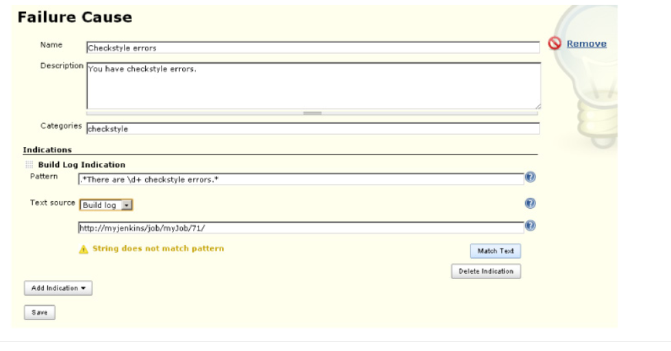

There is a build failure analyzer plug-in which tells us a reason for build failure in case the build gets failed even after following the above steps. The module accompanies an empty information base of failure causes. Populating this learning base is finished by utilizing the connection "Failure Cause Management". The connection has appeared if the consent UpdateCauses is set for the current user. Press "Create New" and include a name and a depiction for the Failure Cause. The depiction ought to contain the motivation behind why this build flopped just as potential answers for the build failure.


## 15. Is there any relationship between Hudson and Jenkins?

## 16. Define the triggers in Jenkins.

There are various ways to re-trigger the pipeline in an automated way, triggers are characterized in the Jenkins. A few of pipelines are cooperating with sources like GitHub, BitBucket, or different triggers first then they are actualized to play out a particular activity.

A build trigger might be utilized for different purposes relying upon the context of the project.

`For instance:` In the event that an enterprise might want to have a CI/CD pipeline setup utilizing Jenkins. In this case, an organization can set up build triggers to trigger downstream system build, for example, 
 * Integration tests
 * Code health check up
 * Load Tests
 * Start to finish Tests
 * Deployment.
* The above steps will be anchored to the parent work and can be activated one by one or in parallel contingent upon the stage (this is the place where build trigger is utilized, trigger the downstream system build if the parent build is a success).
* Build occasionally can be utilized to keep running on standard jobs(in the event that we have a team set up which will be deploying master every evening). At that point, we can set up the jobs to build occasionally late night times at a fixed time (additionally the job can be activated dependent on progress as clarified in (1)
* Polling SCM keeps checking for any new code addition by checking commit history and trigger build thereafter.Pooling your archive and construct dependent on that.

## 17. Polling a Git repository for new commits is considered a Jenkins anti-pattern. What is a sound alternative to SVN polling?

A continuously checking /monitoring SCM tools like GIT or subversion for identifying any new commits are considered a waste of clock cycles and not considered best practices. We should avoid this process. There is a better approach available to us which is a reversal of the above approach. The other approach is industry standard one and more popular. The other approach encourages build getting triggered from source code tool whenever new code is committed or existing code undergoes some change. This is very easy to configure with GitHub or GItLab using a post-commit hook that runs every time code commit is successful. This setup eliminates the need for constantly monitoring source code as a post-commit hook will trigger the build whenever any code gets committed in the source code.

## 18. How can you move or copy Jenkins from one server to another?

Move a job starting with one installation of Jenkins then onto the next by just duplicating the relating work directory. Make a duplicate of a current job by making a clone of a job directory by an alternate name. Rename a current job by renaming a directory. Note that on the off chance that you change a job name you should change whatever other activity that endeavors to call the renamed job. Those tasks should be possible notwithstanding when Jenkins is running. For changes like these to produce results, you need to click "reload config" to compel Jenkins to reload design from the disk.

We can do the steps below to copy Jenkins from the primary server to other servers:

1. As part of the first step, we can start copying and moving Job directory & job name from the primary installation of Jenkins to another one.
2. We can also start making another copy of the already configured job by cloning job directory by renaming it to a different name.
3. Renaming already configured job by giving it some other name.

We can also try one of the plug-ins as well as having Job export options like Job Importer Plugin. Jenkins CLI can be also used if we have less number of jobs but usually at the enterprise level, we have a large number of jobs so not widely used.

## 19. What is the difference between Continuous Integration, Continuous Delivery, and Continuous Deployment?

* Continuous integration

CI is DevOps practices where developers regularly integrate code with at regular time interval  The integration is accompanied by build and tests in an automatic way. The automated testing is optional in  CI but it is implied. The biggest advantage of CI is frequent integration which leads to early detection of errors and early remediation. We can work on changes which lead to specific build error or code issue. Since integration was frequent so fixing becomes easier.

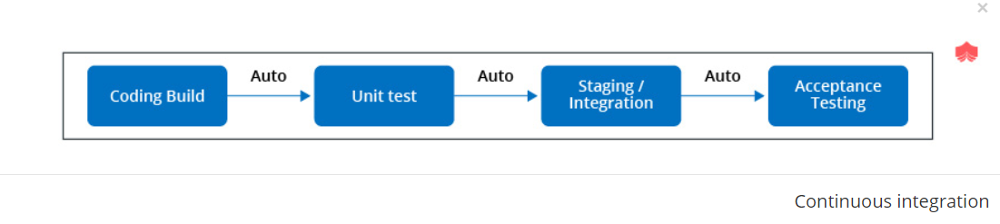

* Continuous delivery 

CD is the next step of CI so it can be considered as an extension of continuous integration which facilitates releasing new changes in the production environment in a controlled way. The code base has to always be in a deployable state to facilitate CD pipeline in DevOps.The continuous delivery ensures seamless delivery of any changes whether it be code /configuration in production. This is very useful for the complex system where several developers working on the same code base making it very challenging to ensuring code base in a deployable state. The advantages of  CD is early detection of production issue and quick fix for same.

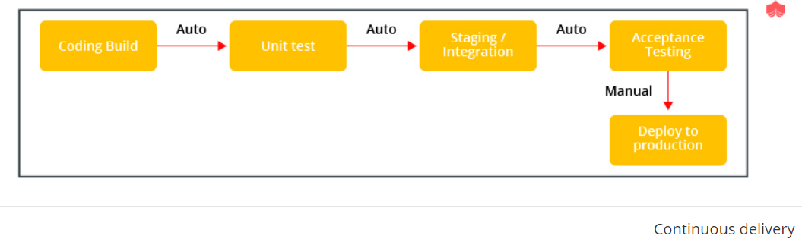

* Continuous deployment

This practice is one more step ahead of continuous delivery. The continuous delivery releases changes in production in a controlled way but continuous deployment facilitate the release of changes to production automatically once all changes pass through production pipeline stages successfully. It ensures no human intervention. The feedback loop is much faster if we enable continuous deployment for our project. It supports the theme fast to market. It is similar to continuous delivery but release happens seamlessly.


## 20. What is the difference between Maven, Ant, and Jenkins?
Maven and ANT are classified as build tool but Maven has one additional advantage that it supports project management, dependency management, and standard project layout. Jenkins is a continuous integration tool which is much more superior than a build tool. ANT is the oldest one in a  lot and widely used build tool. A build tool is useful in creating binary artifacts like JAR file or WAR file. We can easily set up continuous delivery pipeline using Jenkins /Hudson which ensures triggering automatic build, test and deploys code base to production. The gang of four ANT,  Maven, Jenkins, and Hudson are tools for building, uni testing, continuous integration and facilitate project management. 

The Jenkins and Hudson are siblings from the same family while one is enterprise offerings and other is open source supported by dev community. Maven offerings are not mere of any other build tool offerings. We need to set up everything in ANT  like souce, build and target directory while Maven has a predefined structure for same. It is said that convention rule dominates Maven while ANT follows configuration rule. The continuous integration tool helps us in triggering build whenever any new changes committed in the source code which ensures if build gets compiled successfully or not. At the same time when compilation is successful, run the unit test and deploy build at a scheduled time ANT vs Maven

## 21. Why is Jenkins called continuous delivery tool?
Continuous Delivery is the capacity to get changes of assorted types—including new highlights, design changes, bug fixes and analyzes—into generation, or under the control of clients, securely and rapidly in a reasonable manner. We accomplish this by guaranteeing our code is always in a deployable state, even despite groups of thousands of engineers making changes once a day. We along these lines totally kill the integration, testing and hardening stages that generally pursued "dev complete", just as code freezes.

Developers take a shot at their local environment for making changes in the source code and push it into the code repository. At the point when a change is distinguished, Jenkins plays out a few tests and code standards to check whether the changes are great to deploy or not. Upon a successful build, it is being seen by the developers. At that point, the change is conveyed manually on a staging environment where the customer can examine it. At the point when every one of the changes gets approved by the developers, testers, and customers, the final result is saved manually on the production server to be utilized by the end clients of the product. Along these lines, Jenkins pursues a Continuous Delivery approach and is known as the Continuous delivery Tool. Although there are manual steps

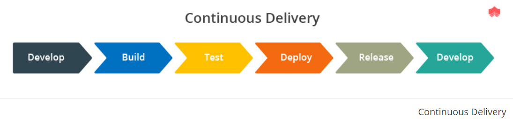